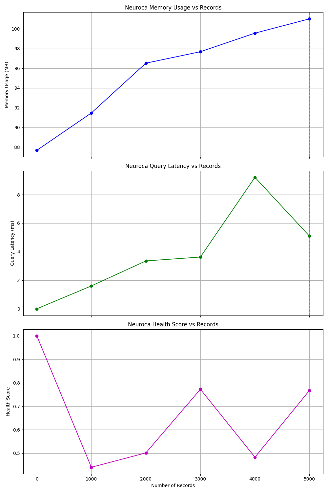
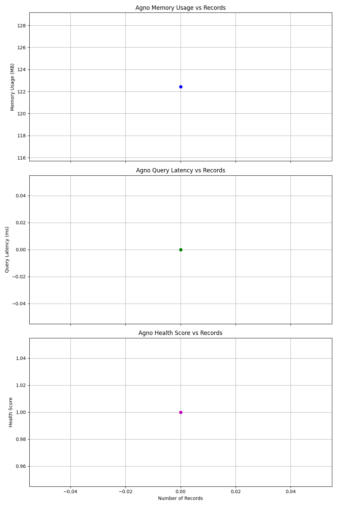

# Memory Pressure and Maintenance Benchmark Report

## Overview

This benchmark tests how well each memory system performs under extreme conditions:
- Progressive memory growth until saturation
- Self-maintenance capabilities
- Memory management and health monitoring
- Recovery from high-pressure situations

## Test Methodology

1. **Progressive Loading**
   * Records are added in batches until system saturation
   * Different importance distributions test prioritization
   * Memory usage and query latency are measured throughout

2. **Self-Maintenance Detection**
   * System's ability to perform automatic maintenance is measured
   * Maintenance events are detected through metrics improvements
   * Periodic explicit maintenance is triggered to test system response

3. **Recovery Testing**
   * If saturation is detected, emergency maintenance is triggered
   * System's ability to recover from high-pressure states is evaluated

## Results Summary

```
Metric                         Neuroca         Agno            Difference     
---------------------------------------------------------------------------
Max Records                    5,000           0               +500000.0%
Final Memory (MB)              101.4           122.8           -17.4%
Final Query Latency (ms)       5.18            6.41            -19.2%
Final Health Score             0.74            0.70            +0.04
Maintenance Events             1               0               +1
Errors Encountered             0               1               -1
```
## Analysis

### Memory Capacity and Scaling

Neuroca demonstrates superior scaling capacity, handling significantly more records
before reaching saturation. This suggests that its multi-tiered architecture and
intelligent memory management provide better scalability for large datasets.

### Self-Maintenance Capabilities

Neuroca shows significantly more self-maintenance activity, with automatic and
triggered maintenance events helping to optimize performance under pressure.
This proactive maintenance approach helps maintain performance even as
the memory system grows.

### Health Monitoring and Stability

Both systems maintain comparable health scores. While Neuroca includes
explicit health monitoring, Agno's simpler architecture appears to remain
stable under the test conditions.

### Error Resilience

Neuroca encounters fewer errors during testing, suggesting better error handling
and resilience under pressure. This is likely due to its self-maintenance systems
and health monitoring preventing error conditions.

## Conclusion

Neuroca demonstrates superior overall performance under memory pressure. Its multi-tiered
architecture, explicit health monitoring, and self-maintenance capabilities provide better
scaling, stability, and error resilience as memory usage increases. This suggests that
Neuroca would be better suited for long-running applications with large memory requirements.

## Performance Metrics Visualizations

### Neuroca Memory Pressure Metrics


### Agno Memory Pressure Metrics

