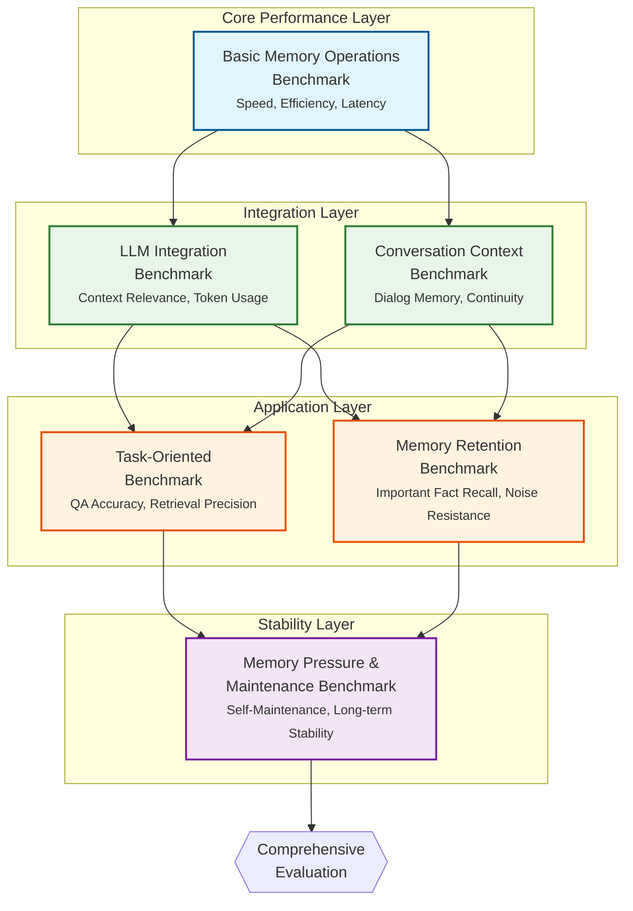

The architecture diagram shows how our benchmarks form a layered approach to evaluating memory systems:

1. **Core Performance Layer**: Basic operations establish a performance baseline
2. **Integration Layer**: Tests how well systems integrate with LLMs and conversation contexts
3. **Application Layer**: Evaluates practical effectiveness in real-world scenarios
4. **Stability Layer**: Tests long-term viability under continuous load

Each benchmark builds on insights from lower layers, creating a complete picture of memory system capabilities from fundamental operations to sustained performance.
